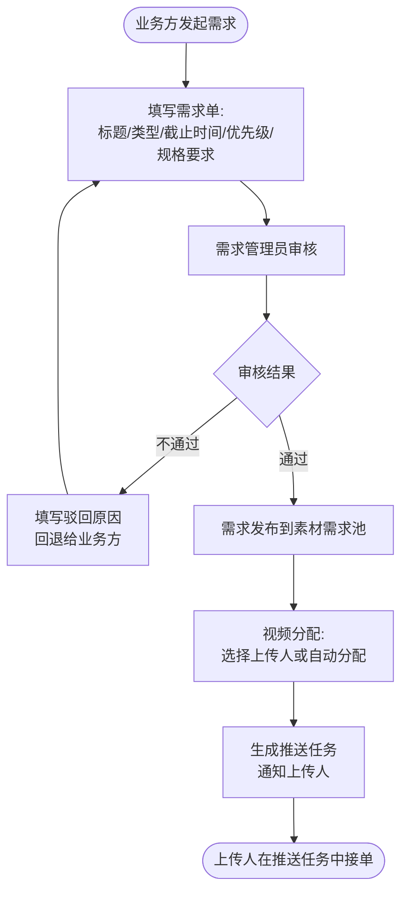
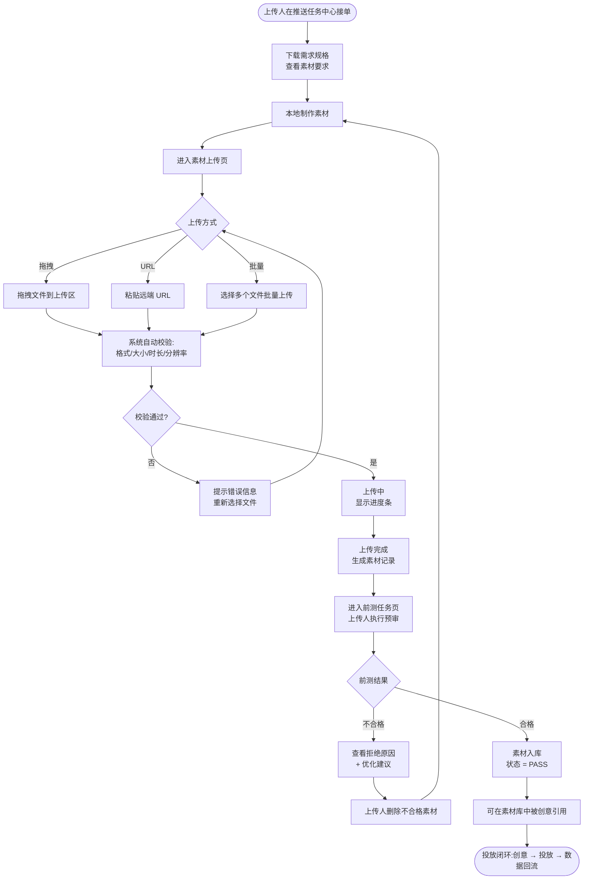

# 巨量引擎素材库管理系统 PRD

| 项目 | 内容 |
|---|---|
| 文档版本 | v1.0 |
| 编写日期 | 2026-06-15 |
| 适用产品 | arco-material-system (Arco Pro + Vue 3 + TS) |
| 目标读者 | 产品 / 设计 / 前端 / 后端 / 测试 / 运营 |

---

## 1. 产品概述

### 1.1 产品定位
面向巨量引擎(OceanEngine)广告投放场景的**素材库管理 SaaS**,围绕"**需求 → 制作 → 上传 → 前测 → 入库 → 投放 → 清理**"的完整闭环,为业务方、设计师、上传人、投手、运营提供统一的素材资产管控平台。

### 1.2 核心价值
- **资产统一**:广告主下所有素材集中管理,跨账户可共享
- **合规前置**:前测任务由上传人执行,把合规检查前置到入库前,减少投放后驳回
- **质量可视化**:AI 评分、状态分布、活跃度一目了然
- **效率闭环**:不合格素材 → 删除重做 → 再走前测,自动化推进

### 1.3 技术栈
Vue 3 · TypeScript · Arco Design Vue · Pinia · Vue Router · ECharts · Vite

---

## 2. 用户角色与典型场景

| 角色 | 占比(预估) | 典型场景 |
|---|---|---|
| **业务方** | 15% | 发起素材需求、跟踪需求进度、查看投放效果 |
| **需求管理员** | 5% | 审核需求、分配上传人 |
| **设计师/上传人** | 35% | 接收推送任务、制作素材、上传、执行前测、删除不合格重做 |
| **素材运营** | 20% | 批量预审、质量分析、清理闲置素材、跨账户共享 |
| **投手/广告主** | 20% | 关联创意、投放、查看素材消耗数据 |
| **团队管理员** | 5% | 成员管理、API 配置、通知设置、权限分配 |

---

## 3. 整体功能架构 (XMind 思维导图)


> 完整版(忠实还原业务结构):[SVG 矢量版](diagrams/xmind-full.svg) | [简化版](diagrams/xmind-overview.png)

### 3.1 功能模块清单

| # | 模块 | 子模块 | 路由 |
|---|---|---|---|
| 1 | **数据概览** | 素材统计、上传趋势、状态分布、存储概览、活跃度 | `/dashboard` |
| 2 | **素材管理** | 列表(网格/列表)、批量操作、上传、URL 上传 | `/material/list`,`/material/upload` |
| 3 | **素材库** | 库列表、前测任务(PRE-TEST) | `/material-lib`,`/material-lib/pretest` |
| 4 | **素材需求** | 需求发布、视频分配、推送任务 | `/material-demand/requirement`,`/material-demand/video-assign`,`/material-demand/push-task` |
| 5 | **创意管理** | 创意列表 | `/creative` |
| 6 | **创意中心** | 图片生成、视频生成 | `/creative-center/image-generate`,`/creative-center/video-generate` |
| 7 | **素材预审** | 批量预审、结果展示 | `/audit/preaudit` |
| 8 | **质量分析** | AI 评分、维度分析、智能标签 | `/audit/quality` |
| 9 | **即创 AIGC** | 视频剪辑、图转视频、素材推送 | `/aigc` |
| 10 | **素材清理** | 条件筛选、批量清理、存储优化 | `/cleanup` |
| 11 | **素材共享** | 跨账户共享、权限管理、有效期 | `/share` |
| 12 | **系统设置** | 个人资料、API 配置、通知设置 | `/settings` |
| 13 | **登录** | 账号登录、广告主切换 | `/login` |
| 14 | **错误页** | 403 / 404 / 500 | `/error/*` |

---

## 4. 核心业务流程

本系统业务流程围绕"**需求发布**"和"**素材交付上传**"两条主线展开,所有其他模块(数据概览、创意、预审、清理、共享)均为这两条主线的支撑。

### 4.1 需求发布流程

**业务目标**:把业务方的素材诉求转化为可执行的上传任务,并精准推送给上传人。


**Mermaid 源码(可在 Markdown 编辑器实时渲染)**:



**关键节点说明**:

| 节点 | 角色 | 操作 | 输出 |
|---|---|---|---|
| 发起需求 | 业务方 | 填写标题、类型(视频/图片)、截止时间、优先级、规格 | 需求草稿 |
| 需求审核 | 需求管理员 | 检查合规性、可行性 | 通过/驳回 + 原因 |
| 需求发布 | 系统 | 进入需求池,可被分配 | 需求 ID |
| 视频分配 | 需求管理员 | 指定上传人 或 自动按工作量分配 | 分配关系 |
| 推送任务 | 系统 | 给上传人生成任务卡 + 站内信/邮件通知 | 推送任务 ID |
| 接收任务 | 上传人 | 在推送任务中心接单 | 任务状态 → 进行中 |

**注意事项**:
- 驳回的需求必须填写原因,否则不允许提交
- 已分配但超过 24 小时未接单的任务,系统自动回收并重新分配
- 同一上传人在同一时间最多持有 5 个进行中任务

---

### 4.2 素材交付与上传流程(含前测与重做) ⭐

**业务目标**:上传人接收任务后,完成素材制作、上传、前测,**不合格的素材必须删除并重做**,直到通过前测才能入库成为可投放资产。


**Mermaid 源码**:



**关键节点说明**:

| 节点 | 角色 | 操作 | 状态变更 |
|---|---|---|---|
| 接收任务 | 上传人 | 在推送任务中心点击"接单" | 任务:待接单 → 进行中 |
| 制作素材 | 上传人 | 按需求规格本地制作 | — |
| 上传素材 | 上传人 | 拖拽/URL/批量三种方式 | 素材:不存在 → 上传中 |
| 自动校验 | 系统 | 检查格式、大小、时长、分辨率 | 校验失败 → 重新选择 |
| 执行前测 | **上传人**(关键!) | 在前测任务页提交预审 | 素材:PENDING → AUDITING |
| 前测判定 | 系统 + 人工 | AI 自动审 + 必要时人工复核 | 素材:AUDITING → PASS / REJECTED |
| **不合格重做** | **上传人** | **删除不合格素材 → 重新制作 → 重新上传 → 重新前测** | 素材:REJECTED → 删除 → 新流程 |
| 入库 | 系统 | 通过前测的素材进入素材库 | 素材:PASS → 可用 |
| 创意引用 | 投手 | 在创意中心关联素材 | 创意:可投放 |
| 投放 | 投手/系统 | 启动投放 | 投放数据回流 |

**重做循环的关键规则(产品硬约束)**:
1. **不合格素材 24 小时内必须删除**,否则系统自动清理并通知上传人
2. 删除操作不可逆,删除前需二次确认弹窗 + 输入"删除原因"
3. 同一需求最多允许 **3 次重做**,超过后任务自动升级为"高优"并由需求管理员介入
4. 重做时**必须复用原需求 ID**,确保数据可追溯
5. 删除记录会进入"素材清理"模块的审计日志

---

## 5. 各功能模块详解

> 每个模块统一模板:**功能描述 · 页面入口 · 关键操作 · 字段/控件 · 状态机 · 注意事项**。

### 5.1 数据概览 (Dashboard)

| 项 | 内容 |
|---|---|
| 路由 | `/dashboard` |
| 适用角色 | 全部(尤其素材运营 / 团队管理员) |
| 主要价值 | 一屏看清素材库健康度、合规度、活跃度 |

**关键操作**:
- 查看 12 项核心指标(详见 §7 数据指标体系)
- 切换"上传趋势"时间维度(7/14/30 天)
- 点击"查看全部"跳转到对应模块
- 点击"去清理"跳转素材清理

**指标体系(详见 §7)**:12 卡 + 6 图 + 2 列表。

---

### 5.2 素材管理

#### 5.2.1 素材列表

| 项 | 内容 |
|---|---|
| 路由 | `/material/list` |
| 视图模式 | 网格 / 列表 双视图切换 |

**关键操作**:
1. **筛选**:类型(视频/图片/音频)、状态(有效/审核中/已拒绝/已下架)、时间范围、标签
2. **搜索**:按素材名称模糊搜索
3. **排序**:上传时间、大小、消耗
4. **批量操作**:勾选多个 → 批量删除/批量预审/批量共享/批量清理
5. **预览**:点击素材弹出预览(视频/图片/音频各自适配播放器)
6. **详情**:查看完整字段(签名、标签、关联创意、消耗数据)

**字段说明**:
| 列 | 说明 |
|---|---|
| 素材名称 | 文件名,可点击进入详情 |
| 类型 | VIDEO / IMAGE / AUDIO / FONT / VOICE |
| 大小 | 自动 B/KB/MB/GB 格式化 |
| 上传时间 | yyyy-MM-dd HH:mm:ss |
| 状态 | VALID / PENDING / AUDITING / REJECTED / DELETED |
| 操作 | 查看、预览、删除、编辑标签、共享 |

#### 5.2.2 素材上传

| 项 | 内容 |
|---|---|
| 路由 | `/material/upload` |
| 适用角色 | 上传人 / 设计师 |

**关键操作**:
1. **选择上传方式**:
   - **拖拽上传**:把文件拖入上传区
   - **URL 上传**:粘贴远端素材 URL,系统拉取
   - **批量上传**:一次选择多个文件
2. **进度追踪**:每个文件显示独立进度条,失败可重试
3. **断点续传**:网络中断后自动续传
4. **上传完成后**:自动跳转到前测任务页(若有关联需求)

**支持的素材类型**:
- 视频:mp4 / mov / avi,最大 2GB,最长 60 秒
- 图片:jpg / png / webp,最大 20MB
- 音频:mp3 / wav,最大 50MB

---

### 5.3 素材库

#### 5.3.1 素材库列表

| 项 | 内容 |
|---|---|
| 路由 | `/material-lib` |
| 与"素材管理"的区别 | 素材库只展示**已通过前测**的可投放素材 |

**关键操作**:同素材管理列表,但增加了"投放使用"维度的筛选(已投放/未投放)。

#### 5.3.2 前测任务 (Pre-test)

| 项 | 内容 |
|---|---|
| 路由 | `/material-lib/pretest` |
| **执行人** | **上传人**(产品核心闭环) |
| 业务定位 | 把合规检查前置到入库前,降低投放后驳回率 |

**关键操作**:
1. 上传人在前测任务页看到"待前测"的素材列表
2. 点击"启动前测"提交审核(AI 自动审 + 异步返回结果)
3. 实时查看前测进度(AUDITING 状态带 pulse 动画)
4. 前测完成后:
   - **PASS**:素材自动入库,可被创意引用
   - **REJECTED**:展示拒绝原因 + 优化建议,要求上传人删除重做
   - **WARNING**:需要人工二次复核

**前测状态机**:
```
PENDING(待前测) ──提交──> AUDITING(审核中) ──通过──> VALID(有效/入库)
                                │
                                └──拒绝──> REJECTED ──删除──> (新流程)
                                │
                                └──告警──> WARNING(需人工复核)
```

---

### 5.4 素材需求

#### 5.4.1 需求发布 (Requirement)

| 项 | 内容 |
|---|---|
| 路由 | `/material-demand/requirement` |
| 入口角色 | 业务方 / 需求管理员 |

**关键操作**:
1. 点击"新建需求"
2. 填写需求表单:
   - **标题**:需求名称,必填
   - **素材类型**:视频/图片,默认视频
   - **数量**:需要多少条素材
   - **截止时间**:DDL,7 天内
   - **优先级**:低/中/高/紧急
   - **规格要求**:时长、分辨率、比例、风格说明
   - **参考素材**:可选上传参考图/参考视频
3. 提交后进入"待审核"状态
4. 需求管理员审核 → 通过则进入需求池,可被分配
5. 驳回则退回给业务方修改

**状态机**:
```
DRAFT(草稿) ──提交──> PENDING(待审核) ──通过──> PUBLISHED(已发布)
                                              │
                                              └──驳回──> REJECTED ──修改──> DRAFT
PUBLISHED ──分配──> ASSIGNED(已分配)
ASSIGNED ──完成──> COMPLETED
```

#### 5.4.2 视频分配 (Video Assign)

| 项 | 内容 |
|---|---|
| 路由 | `/material-demand/video-assign` |
| 角色 | 需求管理员 |

**关键操作**:
1. 查看"已发布未分配"的需求列表
2. 选择需求 → 选择上传人(支持搜索、按工作量排序)
3. 一键分配 → 自动生成推送任务
4. 分配记录可追溯(谁分配的、分配时间)

#### 5.4.3 推送任务 (Push Task)

| 项 | 内容 |
|---|---|
| 路由 | `/material-demand/push-task` |
| 角色 | 上传人(接收方) / 需求管理员(管理方) |

**关键操作(上传人视角)**:
1. 登录后推送任务中心显示"待接单"任务
2. 点击"接单"→ 任务进入"进行中"
3. 完成任务后点击"提交素材"→ 跳转上传页
4. 支持"拒绝接单"(需填写原因)

**关键操作(管理员视角)**:
1. 查看所有上传人的任务负载
2. 重新分配 / 撤销任务
3. 24 小时未接单的任务自动回收并重新分配

---

### 5.5 创意管理

| 项 | 内容 |
|---|---|
| 路由 | `/creative` |

**关键操作**:
1. 创建创意:选择素材 → 填写文案 → 设置投放定向
2. 创意与素材的关联(一个素材可被多个创意引用)
3. 查看创意的素材消耗、曝光、点击、转化数据
4. 创意状态:草稿 / 审核中 / 投放中 / 已暂停 / 已下线

---

### 5.6 创意中心 (AIGC)

#### 5.6.1 图片生成

| 项 | 内容 |
|---|---|
| 路由 | `/creative-center/image-generate` |

**关键操作**:
1. 输入 prompt(中文/英文)
2. 选择风格、写实比例、尺寸
3. 一键生成 4 张候选图
4. 选定后 → 一键入素材库(可作为图片素材入库)

#### 5.6.2 视频生成

| 项 | 内容 |
|---|---|
| 路由 | `/creative-center/video-generate` |

**关键操作**:
1. 输入脚本(prompt)
2. 选择视频时长(5s/10s/30s)、分辨率(720p/1080p)、风格
3. 提交生成任务(异步)
4. 完成后可一键入库

---

### 5.7 素材预审

| 项 | 内容 |
|---|---|
| 路由 | `/audit/preaudit` |
| 角色 | 素材运营 |
| 与"前测任务"的区别 | 前测是**上传人执行**(入库前);预审是**运营批量审核**(已入库素材) |

**关键操作**:
1. 选择素材批次 → 提交预审任务
2. 异步轮询结果
3. 展示拒绝原因 + 优化建议
4. 一键下架不合规素材

---

### 5.8 质量分析

| 项 | 内容 |
|---|---|
| 路由 | `/audit/quality` |

**关键操作**:
1. 选择素材 → 提交质量分析
2. AI 模型输出多维度评分:
   - 清晰度 (Clarity)
   - 亮度 (Brightness)
   - 对比度 (Contrast)
3. 自动生成智能标签、场景标签
4. 雷达图可视化展示

---

### 5.9 即创 AIGC

| 项 | 内容 |
|---|---|
| 路由 | `/aigc` |
| 业务定位 | 字节跳动"即创"工具集成入口 |

**关键操作**:
1. **视频剪辑**:上传素材 → 选择模板 → 一键混剪
2. **图转视频**:图片 + prompt → 生成视频
3. **素材推送**:跨账户推送素材(配合"素材共享"模块)

---

### 5.10 素材清理

| 项 | 内容 |
|---|---|
| 路由 | `/cleanup` |
| 角色 | 素材运营 / 团队管理员 |

**关键操作**:
1. **筛选条件**:
   - 上传时间 > 90 天
   - 最近使用时间 > 30 天(闲置素材)
   - 状态 = 已拒绝/已下架
   - 大小超过阈值
2. 一键预览待清理列表(预估释放空间)
3. 二次确认 → 批量删除
4. 删除记录进入审计日志

**与"重做"的关系**:重做流程中删除不合格素材也会进入此审计日志。

---

### 5.11 素材共享

| 项 | 内容 |
|---|---|
| 路由 | `/share` |
| 角色 | 团队管理员 |

**关键操作**:
1. 选择素材 → 选择目标广告主账户
2. 设置共享类型:READ(只读) / WRITE(可编辑)
3. 设置有效期(7/30/90 天 / 永久)
4. 生成共享链接 / 邀请
5. 撤销共享

---

### 5.12 系统设置

| 项 | 内容 |
|---|---|
| 路由 | `/settings` |

**子模块**:
- **个人资料**:头像、昵称、邮箱、手机号
- **API 配置**:巨量引擎开放平台 Access Token、广告主 ID
- **通知设置**:站内信、邮件、短信、推送渠道开关
- **安全**:修改密码、两步验证、登录设备管理

---

## 6. 角色 × 模块权限矩阵

| 模块 \ 角色 | 业务方 | 需求管理员 | 上传人 | 素材运营 | 投手 | 管理员 |
|---|---|---|---|---|---|---|
| 数据概览 | R | R | R | R | R | R |
| 素材管理 | R | R/W | R/W | R/W | R | R/W |
| 素材库 | R | R | R | R/W | R | R/W |
| 素材需求 | R/W(自己) | R/W | R(分配给自己) | R | — | R/W |
| 创意管理 | R | R | R | R | R/W | R/W |
| 创意中心 | R/W | R | R/W | R/W | R/W | R/W |
| 素材预审 | — | — | — | R/W | — | R/W |
| 质量分析 | R | — | R(自己) | R/W | R | R/W |
| 即创 AIGC | R/W | R | R/W | R/W | R/W | R/W |
| 素材清理 | — | — | — | R/W | — | R/W |
| 素材共享 | — | — | — | R | R/W(自己) | R/W |
| 系统设置 | R/W(自己) | R/W(自己) | R/W(自己) | R/W(自己) | R/W(自己) | R/W |

> R = 只读 / R/W = 读写 / — = 无权限

---

## 7. 数据指标体系

详见 [数据指标与计算公式 §附表](数据指标与计算公式.md),此处仅列字段。

### 7.1 总览层(4 卡)
素材总数 / 今日新增 / 有效素材 / 待处理素材

### 7.2 合规质量层(3 卡)
预审通过率 / 平均质量评分 / 不合规素材

### 7.3 资产活跃层(3 卡)
活跃素材(7 日) / 闲置素材(30 日) / 总消耗

### 7.4 团队运营层(2 卡)
活跃成员(7 日) / 需求完成平均时长

### 7.5 图表层
上传趋势(双轴折线) / 状态分布(环形) / 审核漏斗(漏斗图) / 质量分布(直方图) / Top10 热门(条形) / 存储趋势(面积图)

### 7.6 列表层
即将到期素材 / 最近上传

---

## 8. 非功能性需求

### 8.1 性能
- 首屏 LCP < 2s
- 表格分页加载:50 条/页,首屏渲染 < 500ms
- ECharts 图表懒加载
- 批量上传支持 100 文件并发

### 8.2 可用性
- 关键操作(删除、上传)有二次确认
- 所有异步操作有 loading + 失败 toast
- 表单有字段级 + 表单级校验
- 空状态、错误状态、网络异常状态有友好提示

### 8.3 安全
- 登录态基于 JWT,有效期 8 小时,刷新机制
- 素材签名防盗链
- 删除/共享操作记录审计日志
- 敏感字段(手机号、邮箱)脱敏展示

### 8.4 兼容性
- Chrome ≥ 90,Firefox ≥ 88,Safari ≥ 14,Edge ≥ 90
- 响应式:≥ 1280px 桌面优先,平板 ≥ 768px 自适应

### 8.5 国际化
- v1.0 仅中文
- v2.0 预留 i18n 框架(Arco 内置)

---

## 9. 版本规划

| 版本 | 时间 | 内容 |
|---|---|---|
| v1.0 | 当前 | 全部 12 模块基础功能 |
| v1.1 | +2 周 | 数据概览接入真实接口、修复已知问题 |
| v1.2 | +4 周 | AIGC 深度集成、批量预审性能优化 |
| v2.0 | +8 周 | 国际化、移动端适配、协同编辑 |

---

## 10. 附录

### 10.1 关键术语

| 术语 | 释义 |
|---|---|
| **素材** | 广告投放使用的视频/图片/音频/字体文件 |
| **需求** | 业务方发起的素材制作诉求 |
| **前测** | 上传人对素材执行的入库前预审 |
| **预审** | 运营对已入库素材的批量审核 |
| **推送任务** | 把需求分派给上传人的任务卡 |
| **AIGC** | AI Generated Content,AI 生成内容 |

### 10.2 关联文档

- [README.md](../README.md) - 项目说明
- [接口契约(待补)](../src/api/) - 后端接口定义
- [设计规范](../src/styles/variables.scss) - SCSS 设计令牌

### 10.3 修订记录

| 版本 | 日期 | 作者 | 内容 |
|---|---|---|---|
| v1.0 | 2026-06-15 | PM | 初版,覆盖 12 模块 + 2 主流程 |